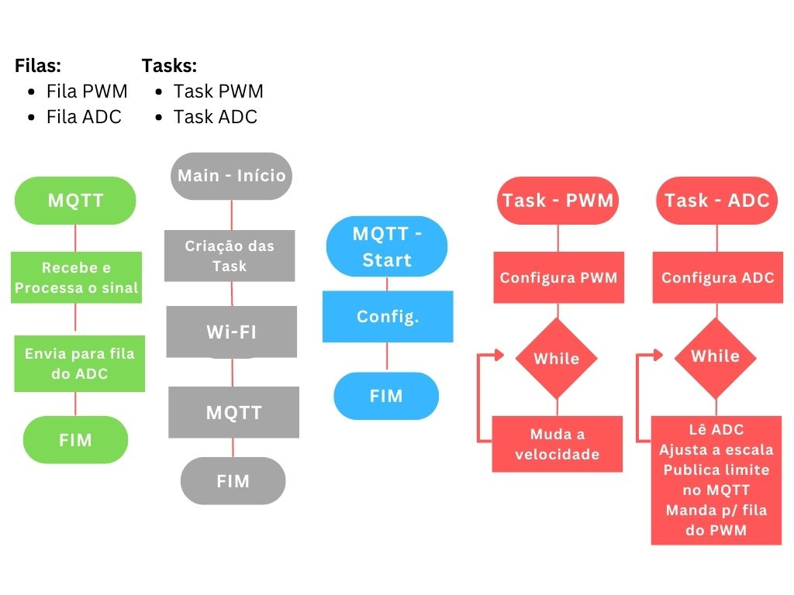

# Trabalho Final

## Introdução

 A fim de aplicar o conhecimento adquirido na disciplina de sistemas embarcado foi desenvolvido um trabalho cujo o objetivo é controlar a velocidade de um motor brushless através de um smartphone via protocolo MQTT. Além disso, poder limitar a velocidade máxima do motor por meio de um potenciômetro de forma que a escala do cursor em um dashboard MQTT no smartphone seja completamente aproveitada. A escolha do trabalho foi feita visando a oportunidade de aplicar os seguintes tópicos aprendidos no decorrer do curso: Periféricos (I/O, PWM, ADC); Sistema de comunicação (MQTT, WIFI); Tasks (x2); Interrupção; fila. Dessa forma, o trabalho escolhido contempla boa parte do que foi lecionado durante o semestre. 

## Materiais
* 1x ESP32-V3
* 1x Potenciômetro de 20k
* 1x Transistor 2N2222A
* 1x Resistor de 1k
* 1x Resistor de 10k
* 1x Protoboard
* ESC EFLA1060
* Turbo fan EFLDF15
* Jumpers
* Fonte DC
* 2x Conector banana - jacaré
* Testador de servo motor genérico
* Osciloscópio
* Protoboard

## Descritivo do funcionamento

 Para compreender o desenvolvimento do trabalho é preciso apresentar de forma sucinta o funcionamento do ESC. A velocidade motor escolhido é controlada por um dispositivo chamado ESC (Eletronic Speed Controller), todo o chaveamento e potência necessários são fornecidos por ele. Para isso, o ESC precisa receber um sinal PWM que será interpretado como a velocidade desejada, esse é o sinal de interesse do nosso trabalho. 

As tarefas que devem ser executadas podem ser abstraidas em 4 etapas:

1. Receber um valor de duty (máximos e mínimos fixos): dashboard MQTT -> ESP32
2. (ESP32) fazer a tratativa do valor recebido e do ADC
3. Retornar o valor tratado do ADC: ESP32 -> dashborad MQTT
4. (ESP32) escrever o duty correspondente aos valores tratados: I/O ESP32 -> ESC

Para isso, o algoritmo implementado no esc seguirá o seguinte fluxograma:

## Metodologia

 Inicialmente, utilizando o osciloscópio a fonte e o testador de servo motor, estudou-se as características do sinal que deve ser aplicado no ESC para que ele atue no controle da velocidade do motor. Conhecendo esse sinal PWM a frequência  foi definida como 50 Hz e a resolução escolhida para o PWM foi de 12 bits. Como a largura do pulso do sinal do testador de servo varia entre 1,2 e 1,8 ms, para a resolução escolhida foi necessário descobrir o valor do duty equivalente. Isso poderia ser feito por cálculos, porém optou-se por criar um pequeno algoritimo para ler o valor de um ADC de 12 bits controlado por um potênciometro e escrever esse valor no duty de um PWM de mesma resolução. Dessa forma, com o auxílio do osciloscópio e do monitor device printando o valor lido pelo ADC, foi possível descobrir os valores máximos e mínimos de duty que serão utilizados. 

 Em seguida, para as configurações do ADC, como a tensão escolhida para ser aplicada no potenciômetro foi de 3,3 V, uma atenuação de 11 dB será utilizada para o ADC. Além da atenuação, é necessário definir a resolução do ADC. Para essa aplicação qualquer resolução do ADC fornecida pelo ESP32 atenderia, apenas a do PWM faria diferença já que a resolução mínima do pwm é de 1 bit, portanto a resolução escolhida para o ADC foi de 12 bits. Sabendo disso, foi calculado uma equação de reta que associasse a leitura do ADC com os valores máximos e mínimos do duty a ser aplicado no PWM. 

 Para finalizar o sinal de controle, tendo em vista o objetivo apresentado na introdução, de poder aproveitar toda a escala do dashboard MQTT, uma segunda equação de reta foi elaborada. Essa segunda equação de reta recebe o duty do dashboard (que foi descoberto no experimento descrito acima. Entre 200 e 370) e associa com o valor limite lido do ADC e convertido pela primeira equação de reta. Como a saída do PWM do ESP32 é em 3,3 V e o ESC precisa de 5 V, foi necessário aplicar um ganho no sinal de controle.

## Resultados
* Diagrama de conexões:

* Sinal esperado pelo ESC: PWM com frequência de 50 Hz, largura de pulso entre 1,2 e 1,8 ms e Vpp do pulso de 5 V

* 1ª equação de reta:

Coeficientes: a = 0,0415 e b = 200

* 2ª Equação de reta:

((valor ajustado para a leitura do ADC pela primeira eq. de reta)-200)/(370-200)*((duty recebido no MQTT)-200) + 200;

* Dashboard MQTT:

* Trabalho em funcionamento:

https://user-images.githubusercontent.com/17216806/208170759-70666423-6043-467c-8aff-e0cf58b1d571.mp4

## Conclusões

