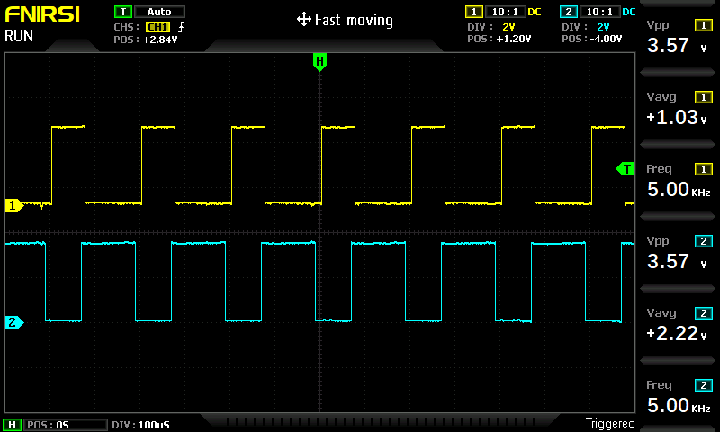

# Questão 1: 
ok

# Questão 2: 
- O algoritmo inicializa 4 PWMs sendo que o PWM nas saídas 18 e 19 são configuradas da mesma forma e nãs saídas 4 e 5 também. Portanto, escolheu-se monitorar, no osciloscópio, o funcionamento das saídas 4 e 19.

- O exemplo faz com que os LED's operem de 4 formas:
1. Fazendo um fade up de 0 até 4000 DUTY com duração de 3s
2. Fazendo um fade down de 4000 até 0 DUTY com duração de 3s
3. Fixando o DUTY em 4000 por 1s
4. Fixando o DUTY em 0 por 1s

- A frequência utilizada é de 5 kHz

- O duty cicle para cada situação foi citado acima

Exemplo da saída:

1. LEDC fade up to duty = 4000
2. LEDC fade down to duty = 0
3. LEDC set duty = 4000 without fade
4. LEDC set duty = 0 without fade

Exemplo de leitura no osciloscópio :

# Questão 3:

