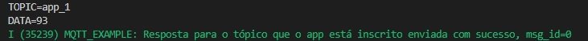

# Questão 1

No algoritmo, quando a conexão mqtt é estabelecida, ocorre a seguinte sequência eventos:

* Disparo de 1 mensagem com a informação "data_3" de qos1 no tópico "/topic/qos1" e o print do id da mensagem enviada
* Msg de solicitação de inscrição de qos0 no tópico "/topic/qos0" e o print do id da mensagem
* Msg de solicitação de inscrição de qos1 no tópico "/topic/qos1" e o print do id da mensagem
* Msg de solicitação de desinscrição do tópico "/topic/qos1" e o print do id da mensagem

Monitor device:

```diff
> I (12598) MQTT_EXAMPLE: Other event id:7 (ocorreu algum evento antes da conexão bem sucedida que não está enumerado pelo esp32)
> I (13538) MQTT_EXAMPLE: MQTT_EVENT_CONNECTED
> I (13538) MQTT_EXAMPLE: sent publish successful, msg_id=59203
> I (13538) MQTT_EXAMPLE: sent subscribe successful, msg_id=18930
> I (13538) MQTT_EXAMPLE: sent subscribe successful, msg_id=61502
> I (13548) MQTT_EXAMPLE: sent unsubscribe successful, msg_id=52786
```

As mensagens de qos1 são respondidas pelo broker e o esp_mqtt_client_register_event aciona a função mqtt_event_handler a cada retorno do broker. A função chamada (ela é chamada a cada evento, ou seja, mais de uma vez) gera a seguinte sequência de reports:

```diff
> I (13838) MQTT_EXAMPLE: MQTT_EVENT_PUBLISHED, msg_id=59203 (O broker retornou resposta do primeiro publish de qos1)
> I (14148) MQTT_EXAMPLE: MQTT_EVENT_SUBSCRIBED, msg_id=18930 (O broker retornou resposta da primeira inscrição de qos0, ele deveria fazer isso?)
> I (14158) MQTT_EXAMPLE: sent publish successful, msg_id=0 (Quando a rotina do esp32 recebe a confirmação de inscrição ele envia outra mensagem de qos0 com a informação "data")
> I (14158) MQTT_EXAMPLE: MQTT_EVENT_SUBSCRIBED, msg_id=61502 (O broker retornou resposta da inscrição de qos1)
> I (14158) MQTT_EXAMPLE: sent publish successful, msg_id=0 (Novamente, quando a rotina do esp32 recebe a confirmação de inscrição ele envia outra mensagem de qos0 com a informação "data")
> I (14168) MQTT_EXAMPLE: MQTT_EVENT_UNSUBSCRIBED, msg_id=52786 (O broker retornou resposta da desinscrição, a desinscrição não tem qos?)
> I (14458) MQTT_EXAMPLE: MQTT_EVENT_DATA (Mensagem recebida do broker que foi enviada pela própria rotina do esp32 ao inscrever em um tópico, mas como o esp32 estava inscrito no mesmo tópico que enviou a mensagem ele também recebe a msg)
> TOPIC=/topic/qos0
> DATA=data
> I (14758) MQTT_EXAMPLE: MQTT_EVENT_DATA (Mensagem recebida do broker que foi enviada pela própria rotina do esp32 ao inscrever em um tópico, mas como o esp32 estava inscrito no mesmo tópico que enviou a mensagem ele também recebe a msg)
> TOPIC=/topic/qos0
> DATA=data
```

# Passos 2 a 4

Feito!

# Questão 5



